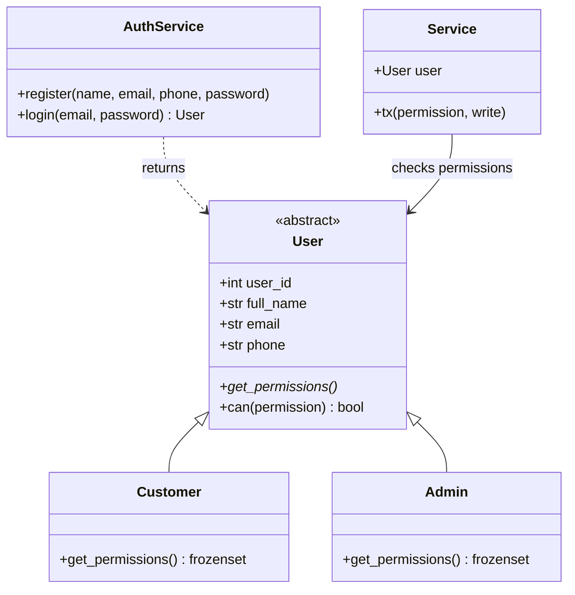
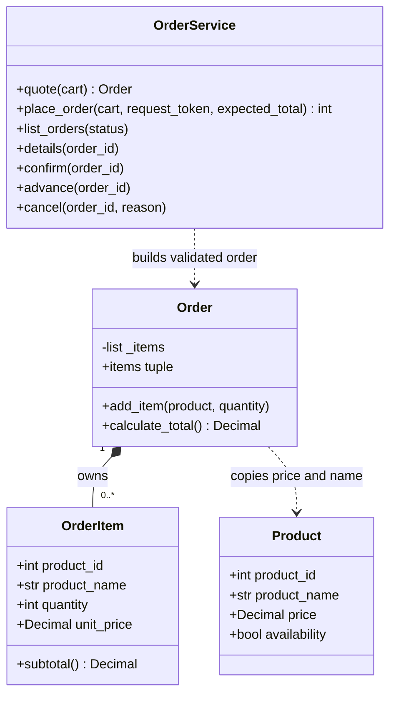
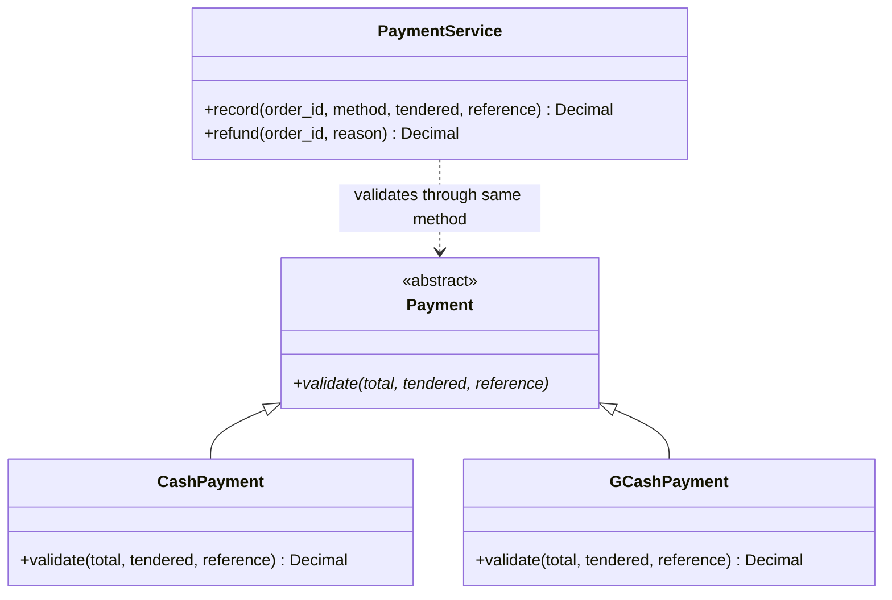
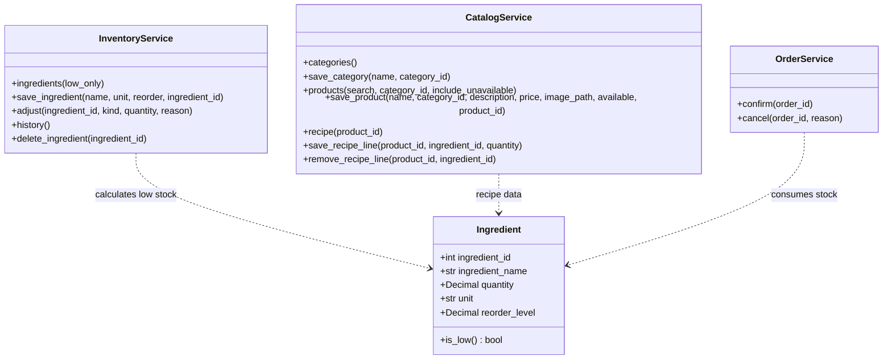

# BrewHub UML and OOP guide

These diagrams describe the actual Python classes delivered in this package.
Paste a `.mmd` file's contents into mermaid.live. Database columns are documented
in `sql/schema.sql` and `setup_db.py`; UML shows Python behavior, not just tables.

## Account types: abstraction, inheritance and polymorphism

`User` cannot be created directly. `Customer` and `Admin` implement the same
`get_permissions()` method differently. `can()` uses that polymorphic method.
The services reload the user's current account from the database before operations.

## Ordering: composition and encapsulation

`Order.add_item()` constructs each order line. The public `items` property returns
a tuple so callers cannot append to the internal list. Each `OrderItem` is a frozen
dataclass. New order lines save their original name and price to the database.
The draft can be empty, but `place_order()` rejects an empty cart.

The composition relationship describes domain ownership. Python garbage collection
does not promise an object is physically destroyed immediately when another object
is deleted. Persistent order lines stay linked to their order; the app preserves
order history instead of deleting completed orders.

## Payments: a second polymorphism example

Cash allows overpayment and returns change. GCash requires the exact amount and
a reference. Both use `validate()`. `PaymentService` adds database checks, including
admin permission, duplicate payments and reused references. This is manual payment
recording, not payment-gateway integration.

## Inventory

All service classes except `AuthService` inherit the common `Service` class.
`ReportService` exposes `summary`, `sales`, `export_sales`, `export_inventory` and
`receipt`. `ProfileService` exposes profile updates, password changes and customer
account management. Their full signatures are in the matching Python files.

## Symbol guide

- `+`: public attribute/method.
- `-`: internal/nonpublic in the design; Python uses conventions/properties.
- Triangle: inheritance.
- Filled diamond: composition/ownership.
- Dotted arrow: uses/depends on another class.
- `0..*`: zero or more in a draft; order submission requires one or more.

